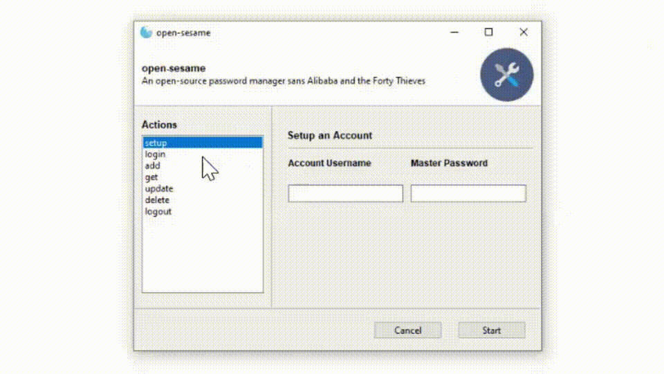

# open-sesame
An open-source password manager sans Alibaba and the Forty Thieves. 

## Introduction

If you're interested in learning more about our motivations, research, and/or development process, check out 'Open Sesame -- Writeup'.pdf! 
If you're just here to demo the product, scroll down to 'Usage' for a step-by-step walkthrough!

## Authors
- Neil Patel '22
- Abby Santiago '22
- Ben Santiago '22

## Usage
1. Install and configure MySQL Server (at least v8) @ https://dev.mysql.com/downloads/installer/
2. Clone the GitHub repo @ https://github.com/nepatel/open-sesame.git
3. Install any missing dependencies (base64, cryptography, python-dotenv, Gooey, mysql-connector-python, os) using pip3
4. Run "manager.py" 
5. If valid .env is not found for a DB connection, prompt the user to generate one on CLI
6. From the Actions side panel, select...
    - "setup" to create an account (required input of username, master password)
    - "login" to login into an account previously setup (required input of username, master password)
    - "logout" to logout of an account (no input required)
7. From the Actions side panel, select... [NOTE: These functions will only work if you succesfully login!]
    - "add" to add a password (required input of service, username, password)
    - "get" to get a password (required input of service, username)
    - "update" to update a password (required input of service, username, password)
    - "delete" to delete a password (required input of service, username)
8. Click...
    - "Start" to perform the action
    - "Cancel" to exit the application
9. If...
    - succesful, click "OK" and view output
    - unsuccesful, raise an GitHub issue detailing your usage and copy the error log
10. To...
    - perform another action, click "Edit"
    - exit the application, click "Close" [NOTE: Unless you explicitly 'logout', you will remain logged in!]

## Help
- Ensure you have installed "mysql-connector-python" and not the deprecated "mysql-connector" using pip3
- Ensure you have installed and configured MySQL (v8 or later)
- Ensure your MySQL Database's HOST/USER/PASSWD/DB_NAME matches the entries in .env
- If you mess up during .env generation, simply open .env using a text editor and...
    a.) set one of the first four variables to an empty string ("") => rerun to reprompt for DB username and password, or
    b.) manually set each of the first three variables to the your MySQL host and credentials => rerun.
- Ensure .env is in the same directory as manager.py
- If "add",  "get", "update", or "delete" are not working, ensure you have successfully logged in with "login"
- If this the first time you are using this app, ensure you have successfully an account with "setup"
- The action "update" only lets you change the password for a login. In order to change more, "delete" the old login and "add" a new one.
- By default, you will stay logged in, even after closing the application or running another instance. In order to make sure someone does not have unauthorized access to your password manager, it is HIGHLY RECOMMENDED to logout of your session with the command 'logout.'

## Technologies
- Cryptography (Encryption library)
- Gooey (GUI library)
- MySQL (Database)

## Disclaimer
We provide no guarantees for this product. This is first and foremost an educational project, not an enterprise solution. In its current state, this password manager has many issues. Moreover, here's why you should not "roll your own" password manager [1]. Our implementation is no exception. If you are keen on using an open-source password manager, we recommend the free, cross-platform password manager KeePass [2].

## References
[1] https://security.stackexchange.com/questions/18197/why-shouldnt-we-roll-our-own
[2] https://keepass.info/
